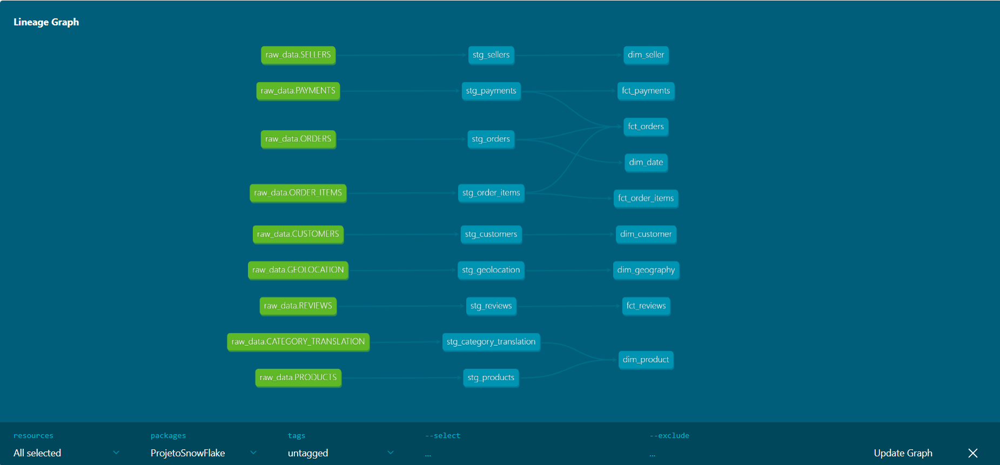
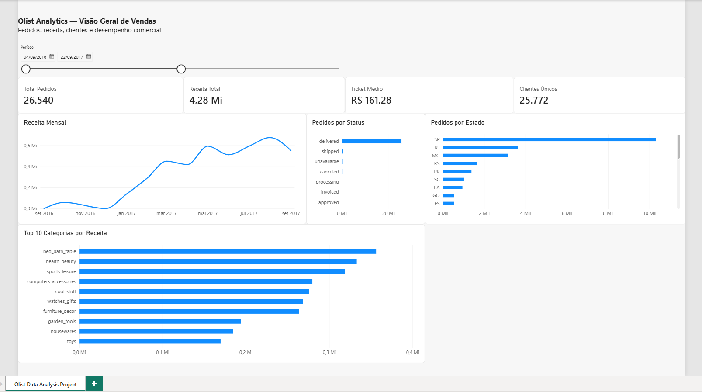

# Olist Analytics --- Modern Data Platform

Projeto end-to-end de Engenharia de Dados construído sobre o dataset
público da Olist, cobrindo ingestão, armazenamento em Data Lake,
integração, transformação, qualidade, governança, orquestração e consumo
analítico.

> **Fluxo:** Olist/Kaggle → Python → Azure Data Lake Storage → Azure
> Data Factory → Snowflake → dbt Core → Apache Airflow → Power BI

## 🎯 Objetivo

O objetivo deste projeto é demonstrar a construção de uma plataforma
moderna de dados, organizando o pipeline desde a origem até a camada de
consumo. A solução combina serviços Azure, Snowflake, dbt e Airflow para
criar um fluxo reproduzível, testável e governado.

## 🏗️ Arquitetura

``` text
Olist / Kaggle
      │
      ▼
Python — download e preparação dos arquivos
      │
      ▼
Azure Data Lake Storage Gen2
      │
      ▼
Azure Data Factory
      │
      ▼
Snowflake RAW
      │
      ▼
dbt Core — Silver / Staging
      │
      ▼
dbt Core — Gold / Dimensional Model
      │
      ▼
Power BI

Orquestração end-to-end: Apache Airflow / Astro
```

## 🧰 Stack

  -----------------------------------------------------------------------
  Camada                  Tecnologia              Responsabilidade
  ----------------------- ----------------------- -----------------------
  Fonte                   Olist / Kaggle          Dataset de e-commerce

  Preparação              Python                  Download e preparação
                                                  dos arquivos

  Data Lake               Azure Data Lake Storage Landing zone dos dados
                          Gen2                    

  Integração              Azure Data Factory      Carga ADLS → Snowflake

  Data Warehouse          Snowflake               RAW, Silver, Gold e
                                                  governança

  Transformação           dbt Core                Staging, dimensões,
                                                  fatos e testes

  Orquestração            Apache Airflow / Astro  Controle do pipeline
                                                  end-to-end

  Consumo                 Power BI                Visualização dos dados
                                                  da camada Gold

  Versionamento           Git / GitHub            Código e artefatos do
                                                  projeto
  -----------------------------------------------------------------------

## 🔄 Transformação e modelagem com dbt

A transformação foi estruturada em duas camadas principais:

**Silver / Staging** --- padronização, tipagem e preparação dos dados
provenientes da camada RAW.

**Gold** --- modelo analítico com dimensões e fatos preparado para
consumo e análise.

O projeto dbt possui **18 modelos, 9 sources e 100 testes de Data
Quality**.

### Data Lineage

O grafo abaixo, gerado pelo dbt Docs, mostra as dependências entre as
fontes RAW, os modelos de staging e os modelos dimensionais da camada
Gold.



## ✅ Data Quality

A qualidade é validada durante o pipeline antes de considerar a
transformação concluída. Entre as verificações implementadas estão:

-   `not_null` e `unique` em chaves relevantes;
-   testes de relacionamento entre modelos;
-   validação de combinações de colunas com `dbt_utils`;
-   validações de granularidade e cardinalidade;
-   reconciliação entre valores financeiros;
-   comparações entre as camadas Silver e Gold.

A execução validada do projeto concluiu **100 testes dbt com sucesso**.

## 🔐 Governança no Snowflake

Além da modelagem analítica, o projeto inclui exemplos de governança e
controle de acesso no Snowflake:

-   RBAC com roles específicas;
-   Dynamic Data Masking;
-   Row Access Policy;
-   classificação de dados por Tags;
-   Resource Monitor;
-   warehouses separados para workloads analíticos e BI;
-   laboratório de recuperação com Snowflake Time Travel.

Os scripts estão organizados em [`snowflake/`](snowflake/).

## ⚙️ Orquestração com Apache Airflow

A DAG `olist_analytics_pipeline` coordena o fluxo completo e aplica
comportamento fail-fast: uma etapa posterior só é executada quando sua
dependência anterior termina com sucesso.

``` text
start_pipeline
      ↓
ingest_olist_data
      ↓
run_adf_pipeline
      ↓
wait_adf_pipeline
      ↓
prepare_dbt
      ↓
dbt_run
      ↓
dbt_test
```

O Airflow executa a ingestão em Python, dispara o Azure Data Factory,
aguarda a conclusão da carga no Snowflake e somente então executa as
transformações e testes dbt.

A DAG está em
[`airflow/dags/olist_pipeline.py`](airflow/dags/olist_pipeline.py).

## 📊 Power BI --- camada de consumo

O Power BI representa a última etapa da arquitetura, consumindo o modelo
dimensional disponibilizado na camada Gold do Snowflake.

O dashboard apresenta indicadores como total de pedidos, receita, ticket
médio e clientes únicos, além de análises mensais, status dos pedidos,
distribuição por estado e categorias de produtos.



O arquivo `.pbix` também está disponível no repositório em
[`powerbi/OlistPowerBi.pbix`](powerbi/OlistPowerBi.pbix).

## 📁 Estrutura do repositório

``` text
.
├── adf/
├── airflow/
│   ├── dags/
│   ├── include/
│   │   ├── ingestion/
│   │   └── dbt/
│   └── tests/
├── docs/
│   └── images/
├── powerbi/
│   ├── OlistPowerBi.pbix
│   └── images/
├── snowflake/
│   ├── setup/
│   ├── raw/
│   ├── security/
│   ├── validation/
│   └── labs/
└── README.md
```

## 🚀 Execução local

``` bash
cd airflow
astro dev start
```

Para trabalhar diretamente com o projeto dbt:

``` bash
cd airflow/include/dbt
dbt deps --profiles-dir .dbt
dbt run --profiles-dir .dbt
dbt test --profiles-dir .dbt
```

Para gerar a documentação e visualizar o lineage:

``` bash
dbt docs generate --profiles-dir .dbt
dbt docs serve --profiles-dir .dbt
```

## 🔧 Configuração

Credenciais não são versionadas. O perfil dbt utiliza variáveis de
ambiente para conexão com o Snowflake:

``` text
DBT_SNOWFLAKE_ACCOUNT
DBT_SNOWFLAKE_USER
DBT_SNOWFLAKE_PASSWORD
DBT_SNOWFLAKE_WAREHOUSE
DBT_SNOWFLAKE_DATABASE
DBT_SNOWFLAKE_SCHEMA
DBT_SNOWFLAKE_ROLE
```

A ingestão utiliza `AZURE_STORAGE_SAS_TOKEN`. O Airflow também requer a
connection `azure_data_factory_default` configurada no ambiente.

Arquivos `.env`, credenciais e artefatos locais sensíveis são ignorados
pelo Git e não devem ser versionados.

## 📌 Principais resultados

A solução final integra diferentes componentes de uma plataforma moderna
de dados em um único pipeline: ingestão automatizada, armazenamento no
ADLS, carga pelo ADF, modelagem no Snowflake com dbt, testes de
qualidade, controles de governança, orquestração com Airflow e consumo
no Power BI.

O projeto foi desenvolvido como estudo prático de arquitetura e
Engenharia de Dados, com foco não apenas em fazer a carga funcionar, mas
em demonstrar organização por camadas, qualidade, rastreabilidade,
segurança e automação.

------------------------------------------------------------------------

**Autor:** Luiz Jesus\
**Projeto:** Olist Analytics --- Modern Data Platform
